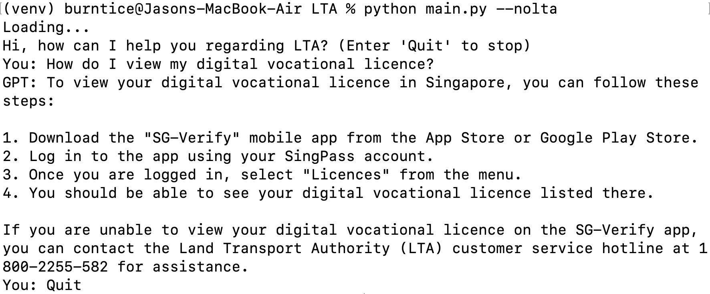
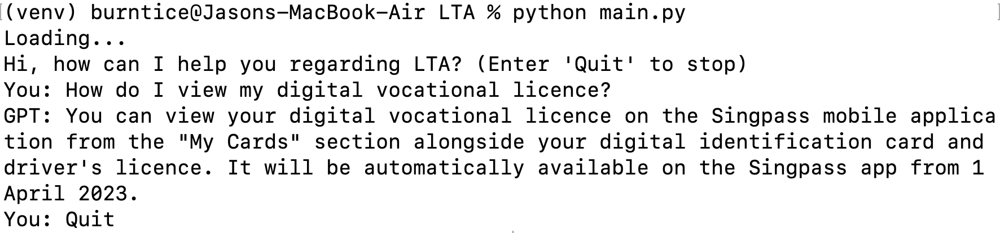

# LTA Challenge

Incorporate new LTA-related information (September 2021 and beyond) into an OpenAI GPT model.

Sample question: `How do I view my digital vocational licence?`

Without the latest LTA information: wrong answer...



With the latest LTA information: correct answer!



## Prerequisites

Operating System: macOS Ventura 13.3 / Ubuntu 22.04  
Programming Language: Python 3.10

## Set-up

Create and activate a virtual environment:

```bash
python3 -m venv venv
source venv/bin/activate
```

Run the following commands to set up the environment:

```bash
pip install -r requirements.txt
pre-commit install
```

Create a `.env` file with the following content:
```
OPENAI_API_KEY=your_api_key
```

## Run

Start a chat session to enquire about latest LTA information:
```bash
python main.py
```

Start a chat session without the latest LTA information:
```bash
python main.py --nolta
```

## References

1. [LTA News Room](https://www.lta.gov.sg/content/ltagov/en/newsroom.html)
2. [Beautiful Soup Documentation](https://beautiful-soup-4.readthedocs.io/en/latest/)
3. [OpenAI question-answering: Finetuning GPT-3 vs Semantic Search](https://www.youtube.com/watch?v=9qq6HTr7Ocw)
4. [OpenAI pricing](https://openai.com/pricing)
5. [Chat completion](https://platform.openai.com/docs/guides/chat/introduction)
6. [What are embeddings](https://platform.openai.com/docs/guides/embeddings/what-are-embeddings)
7. [Question-answering using embeddings cookbook](https://github.com/openai/openai-cookbook/blob/main/examples/Question_answering_using_embeddings.ipynb)
